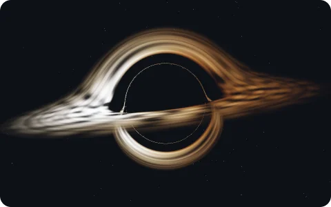

<picture>
  <source media="(prefers-color-scheme: dark)" srcset="media/name-dark.png">
  
</picture>

<samp>ai evals &nbsp;·&nbsp; web &nbsp;·&nbsp; maharashtra, india</samp>

I write tasks that try to trip up AI coding agents, and the graders that check whether they
actually got it right. I also like building web pages that move: GSAP, three.js, and the
occasional [black hole](https://github.com/samyyy2423/black_hole_with_C).

<samp>now&nbsp;&nbsp;&nbsp;</samp> AI benchmark engineer at Turing 
<samp>before</samp> agentic task design at Handshake AI

<samp>things I've made</samp>

- [splitpoint](https://github.com/samyyy2423/splitpoint): finds the step where a failing agent run went wrong
- [dependency_checker](https://github.com/samyyy2423/dependency_checker): npm audit + outdated packages in one readable report
- [webserver_with_C](https://github.com/samyyy2423/webserver_with_C): an HTTP server from scratch, to finally understand sockets
- [black_hole_with_C](https://github.com/samyyy2423/black_hole_with_C): ray-traced gravitational lensing in OpenGL

<samp>[portfolio](https://samyaksportfolio.vercel.app/) &nbsp;·&nbsp; [linkedin](https://www.linkedin.com/in/samyakpudke/) &nbsp;·&nbsp; workitsam01@gmail.com</samp>
