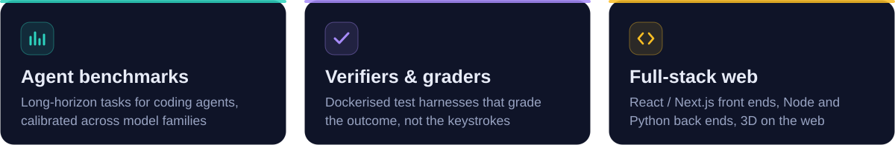
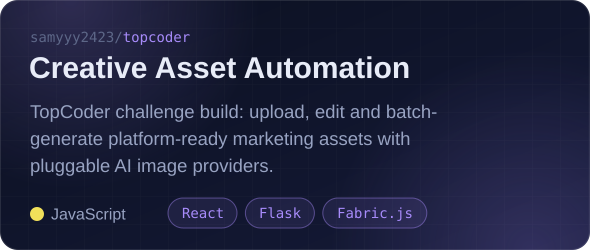
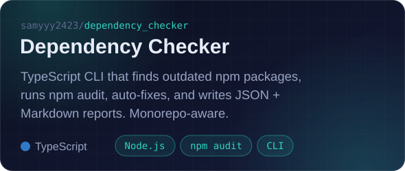
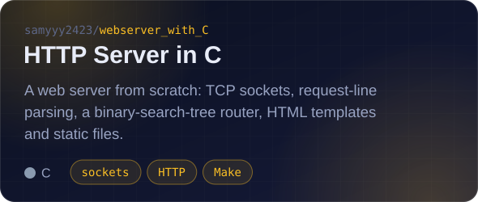
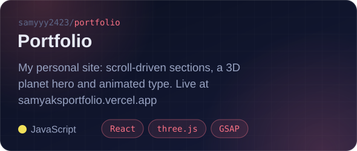
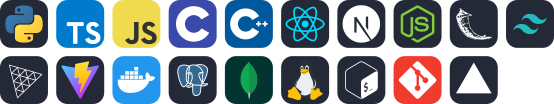

  &nbsp;
  &nbsp;
  &nbsp;
  

  I build benchmarks that measure what AI coding agents can really do: task environments, reference solutions 
  and graders that hold up against frontier models. I also build the web apps and tooling around them.

  🔭 <b>Now:</b> AI Benchmark Engineer @ Turing &nbsp;·&nbsp; 🧪 <b>Before:</b> agentic task design @ Handshake AI &nbsp;·&nbsp; 📍 India, working remote

 

<h2>⚡ Featured work</h2>

  
  

  
  

<h2>🧰 Toolbox</h2>

  

Evals: Harbor / Terminal-Bench tasks · Docker · pytest · LLM-as-judge · Anthropic API · DuckDB · Pydantic

